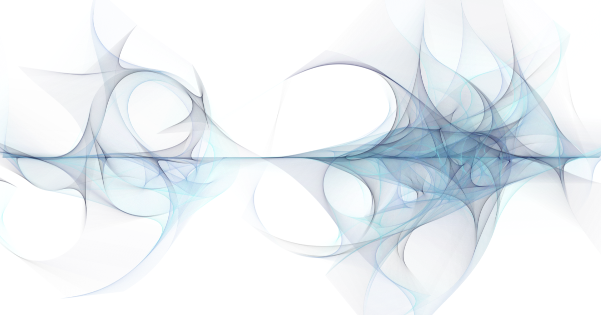

# Art
*A code-art project to explore beautiful things can be made with math, chaos and randomness.*

 <a href="https://michaelruppe.github.io/art/sway/">Sway</a> 

---

### These are demos can run in your browser - they're built with [p5.js](https://p5js.org/)

- **[sway](https://michaelruppe.github.io/art/sway/)**. A smooth, colourful tangle - each particle is assigned its own flow field to move within. Each particle-pair will draw with a colour chosen out of a pallette.

- **[perf](https://michaelruppe.github.io/art/perf_animated/perf-p5/)**. A noise study with simplex noise to create an organic-looking environment. Reminiscent of cellular automata.

- **morph**: More experiments with `noise()`
  
  - [demo3](https://michaelruppe.github.io/art/morph/03/index.html) - In my opinion, the most visually pleasing demo. Now with *asymmetry*.
  - [demo5](https://michaelruppe.github.io/art/morph/05/index.html) - R,G,B entities
  - [demo4](https://michaelruppe.github.io/art/morph/04/index.html) - user-sliders for playing with parameters
  - [demo2](https://michaelruppe.github.io/art/morph/02/index.html) - symmetric demo with self-erasing tail to prevent things getting too noisy.
  - [demo1](https://michaelruppe.github.io/art/morph/01/index.html) - first attempt.

- **flow field** ([demo](https://michaelruppe.github.io/art/flow_field/index.html)): Sprinkles particles onto a slowly changing force vector field. The field is updated with perlin noise and the particles trace their trajectory. It procedurally draws images that look something like this:

- **particle** ([demo](https://michaelruppe.github.io/art/particle/index.html)): An attempt at re-creating the beautiful background animation present on [particle.io](https://particle.io).

- **fern** ([demo](https://michaelruppe.github.io/art/fern/index.html)): A procedurally generated fractal fern. See [Wiki: Barnsley Fern](https://en.wikipedia.org/wiki/Barnsley_fern)

- **rainy pi** ([demo](https://michaelruppe.github.io/art/rainy_pi/index.html)): Count raindrops that fall randomly on a square and a circle with equal "diameter". The ratio of the counts can be used to approximate the value of Pi!

### These are demos built with [Processing](https://processing.org/).
You'll have to download the file/repo to run them.
- [solar system simple](solar_system_simple/): Simulate a solar system with simple physics engine. Elliptical orbits made by calculating velocity for circular orbit then randomly tweaking.

### Credits
Gifs made with [ShaderGif](https://shadergif.com/)
